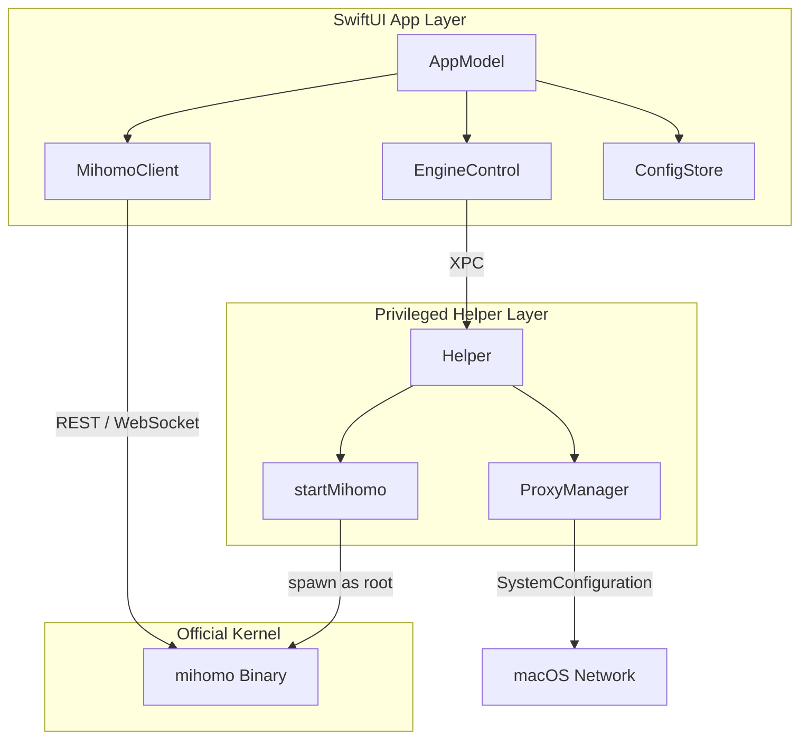

# ClashPow 架构说明

ClashPow 是「原生编排器」:纯 Swift GUI 直接驱动官方 `mihomo` (Clash.Meta) 内核,特权操作交由独立签名的 Helper。无中间引擎层,GUI 直连内核 REST/WS。

## 逻辑分层

### 1. GUI 层(`Sources/`,全 `@MainActor`)
- **AppModel**(`Model/AppModel.swift`):单一真相源 + 编排中枢(`AppModel.shared`),持有 `api`/`engine`/`store`/`history`,驱动全部 UI。
- **MihomoClient**(`XPC/MihomoClient.swift`):纯 Swift REST/WS 客户端。`probe()` 探活;`stream()` 订阅 `/traffic`、`/connections`、`/logs`(断线自动重连);其余封装 mihomo REST API。启动时 `applyController(fromConfigAt:)` 从内核 config 发现 external-controller/secret。
- **EngineControl**(`XPC/EngineControl.swift`):内核生命周期(`ensureInstalled`/`ensureRunning`/`restart`)与「用户态 ↔ Root 态」切换;启动前 `hardenControllerConfig`(绑回环 + 强 secret)、`normalizeGeoxURL`(修正失效 geodata 源)。
- **ConfigStore**(`Model/ConfigStore.swift`):多套 YAML profile 管理,远程订阅 URL 存 Keychain。

### 2. 特权 Helper 层(`Sources/Helper/` + `Sources/XPC/`)
- 独立编译的 LaunchDaemon,Mach service `com.clashpow.helper`,经 `HelperProtocol` 做 XPC。
- 能力:`getVersion` / `setSystemProxy` / `startMihomo` / `stopMihomo`。
- 连接经客户端代码签名校验(`identifier "com.clashpow.app"`),`startMihomo` 限定内核路径白名单。
- 安装/卸载由 `XPCManager` 经 `osascript ... with administrator privileges` 完成(`enable` + `bootstrap`,卸载用 `bootout`)。

### 3. 内核层
官方 `mihomo`(darwin-arm64)。直接处理网络报文,GUI 仅展示与控制。

## 核心工作流

- **启动**:`AppModel.start()` → `ensureInstalled`(seed 内核 + 规范化 config)→ `applyController` 发现端点 → `ensureRunning` → `reconnect` 握手 → 建 WS 长连 + 3s 轮询。
- **TUN**:需 root → 未装 Helper 先授权安装 → `restart()` 杀旧内核并以 root 重启 → PATCH `tun.enable=true`;据内核真实状态(`enable && runningAsRoot`)提示成功/失败。
- **系统代理**:优先 Helper,否则 `networksetup` osascript 兜底。
- **配置变更**:经 `/configs` PATCH(内核校验+回滚);切换 profile 写文件 + `?force=true` PUT 热重载。

## 默认连接参数
external-controller 绑回环 `127.0.0.1`,secret 启动时规范化为强随机值。数据目录 `~/Library/Application Support/ClashPow`。
