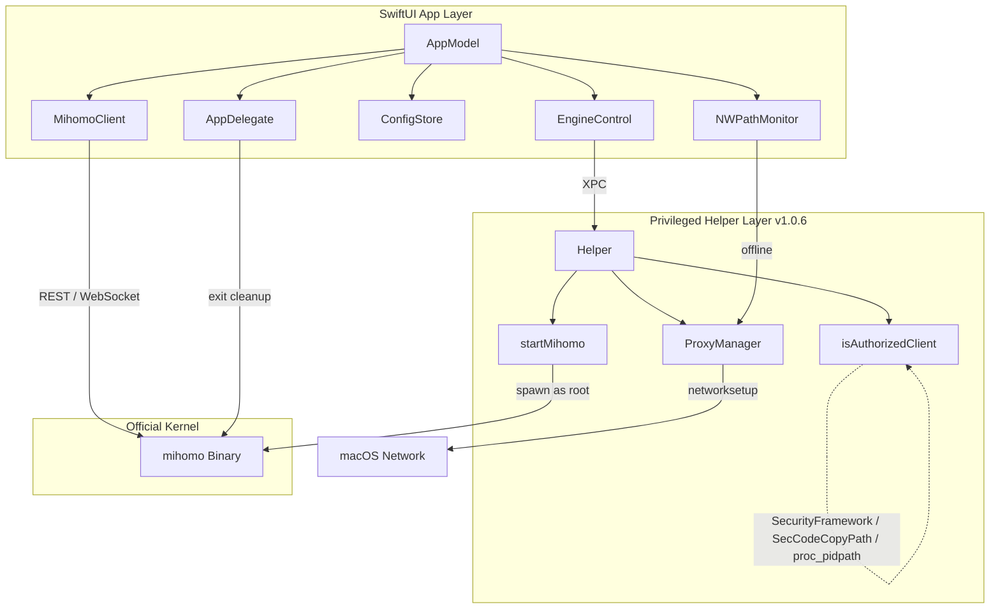

# ClashPow 架构说明

ClashPow 是「原生编排器」：纯 Swift GUI 直接驱动官方 `mihomo` (Clash.Meta) 内核，特权操作交由独立签名的 Helper。无中间引擎层，GUI 直连内核 REST/WS。

## 逻辑分层

### 1. GUI 层（`Sources/`，全 `@MainActor`）

- **AppModel**（`Model/AppModel.swift`）：单一真相源 + 编排中枢（`AppModel.shared`），持有 `api`/`engine`/`store`/`history`，驱动全部 UI。按功能拆分为 4 个 extension：
  - `AppModel+Config.swift`：配置/开关域（`toggleTUN` / `toggleSystemProxy` / `patch` / `activateProfile`）
  - `AppModel+Proxies.swift`：代理组/节点/延迟测速
  - `AppModel+Connections.swift`：连接快照/流量聚合/仪表盘
- **MihomoClient**（`XPC/MihomoClient.swift`）：纯 Swift REST/WS 客户端。`probe()` 探活；`stream()` 订阅 `/traffic`、`/connections`、`/logs`（断线自动重连）；启动时 `applyController(fromConfigAt:)` 从 config 发现 external-controller/secret。
- **EngineControl**（`XPC/EngineControl.swift`）：内核生命周期（`ensureInstalled`/`ensureRunning`/`restart`/`stopKernel`）与「用户态 ↔ Root 态」切换；`kExpectedHelperVersion` 驱动自动升级；`syncRunningAsRootIfNeeded()` 用 `pgrep` 同步 root 状态。
- **ConfigStore**（`Model/ConfigStore.swift`）：多套 YAML profile 管理，远程订阅 URL 存 Keychain。
- **AppDelegate**（`App/ClashPowApp.swift`）：`applicationWillTerminate` + SIGTERM/SIGINT handlers → `killall -9 mihomo` + `setSystemProxy(false)`；一次性 `DispatchSemaphore` 防竞争。
- **NWPathMonitor**（`AppModel.swift`）：离线时自动关闭系统代理。

### 2. 特权 Helper 层（`Sources/Helper/` + `Sources/XPC/`）

- 独立编译的 LaunchDaemon（**v1.0.6**），Mach service `com.clashpow.helper`，经 `HelperProtocol` 做 XPC。
- 能力：`getVersion` / `setSystemProxy` / `startMihomo` / `stopMihomo`。
- **`isAuthorizedClient` 三层鉴权**：
  1. `SecCodeCheckValidity(kSecCSBasicValidateOnly, identifier "com.clashpow.app")` — 跳过可执行+资源校验，兼容 ad-hoc 签名
  2. `SecCodeCopyStaticCode` + `SecCodeCopyPath` — bundle 根路径回退
  3. `proc_pidpath` — 直接读取进程可执行路径，不依赖签名框架；ad-hoc 必然通过
- `startMihomo`：先 `killall -9 mihomo` 清理遗留进程，再启动；三段式 stop（SIGTERM → 1.5s 等待 → SIGKILL）。
- **版本管理**：`XPCManager.upgradeDaemon()` = `uninstallDaemon()` + 800ms 间隔 + `installDaemon()`；`EngineControl.checkAndUpgradeHelperIfNeeded()` App 启动 4s 后静默调用。
- 安装/卸载/升级均由 `XPCManager` 经 `osascript ... with administrator privileges` 完成。

### 3. 内核层
官方 `mihomo`（darwin-arm64）。直接处理网络报文，GUI 仅展示与控制。**签名时故意不加 `--options runtime`**（hardened runtime 阻断 `AF_SYSTEM` socket，utun TUN 设备无法创建）。

## 核心工作流

**启动：**
`AppModel.start()` → `ensureInstalled`（seed 内核 + 规范化 config）→ `applyController` 发现端点 → `ensureRunning` → `reconnect` 握手 → 建 WS 长连 + 3s 轮询 → **4s 后 `checkAndUpgradeHelperIfNeeded`** 检测并静默升级 helper。

**TUN 开启（`toggleTUN`）：**
1. 检查 `engine.isRoot` + `engine.helperVersion`
2. 未装 Helper → `installPrivileged()` 弹授权
3. Helper 版本过旧 → `upgradeDaemon()` 静默升级
4. `engine.restart()` 杀旧内核、以 root 重启（via Helper `startMihomo`）
5. **轮询等待**（最多 10s）：`api.reachable && engine.runningAsRoot`
6. `reconnect()` 重建 WS 连接
7. PATCH `tun.enable=true` → `refreshConfigs()` 确认（`enable && runningAsRoot`）

**runningAsRoot 同步：**
- `ensureRunning()`：kernel 已在线时 `pgrep -u root -x mihomo` 判断是否已 root，避免无谓重启
- `pollStatus()`（每 2s）：helper 活跃 + api 可达 + `runningAsRoot=false` 时自动同步

**退出清理：**
`AppDelegate.applicationWillTerminate` / SIGTERM / SIGINT → `AppDelegate.performCleanup()`（一次性锁）→ `killall -9 mihomo` + helper XPC `setSystemProxy(false)`

**系统代理：** 优先 Helper XPC，否则 `networksetup` osascript 兜底；`NWPathMonitor` 离线自动关闭。

**配置变更：** 经 `/configs` PATCH（内核校验+回滚）；切换 profile 写文件 + `?force=true` PUT 热重载。

## 默认连接参数
external-controller 绑回环 `127.0.0.1`，secret 启动时规范化为强随机值。数据目录 `~/Library/Application Support/ClashPow`。Helper 日志：`/Library/Logs/ClashPow/helper.log`；mihomo root 日志：`/Library/Logs/ClashPow/mihomo-root.log`。
